# Incident Response Report — Simulated Metasploitable 2 Compromise

**Analyst:** Imam Hussain Shaik  
**Date:** August 27, 2026  
**Classification:** Simulated — isolated home lab environment  
**Prepared for:** Portfolio / GitHub  

---

## 1. Executive Summary
In a controlled lab exercise, a Kali Linux attacker system scanned and exploited the Metasploitable 2 VM using a known FTP backdoor vulnerability. The compromise was detected through monitoring tools, and the environment was contained. Since this was an isolated lab, no external systems were impacted.

---

## 2. Scope & Environment
| Item | Detail |
|---|---|
| Attacker system | Kali Linux, IP 192.168.15.137 |
| Target system | Metasploitable 2, IP 192.168.15.129 |
| Detection tooling | Wireshark |
| Network | Isolated host-only segment, no external exposure |

---

## 3. Timeline of Events
| Time | MITRE ATT&CK Stage | Action | Evidence |
|---|---|---|---|
| 01:47 | Reconnaissance (TA0043) | Nmap scan of target | Fig. Recon-1 |
| 01:50 | Initial Access (TA0001) | Exploited vsftpd 2.3.4 via Metasploit | Fig. Exploit-1 |
| 02:09 | Execution (TA0002) | Meterpreter session established, root shell gained | Fig. Exec-1 |
| 02:15 | — | Detection alert triggered in Wireshark | Fig. Net-1 |

---

## 4. Technical Findings

### 4.1 Reconnaissance
Nmap revealed multiple open ports and services, including FTP (vsftpd 2.3.4), SSH, Telnet, SMTP, HTTP, MySQL, PostgreSQL, and Samba. The FTP service version was identified as vulnerable.

### 4.2 Vulnerabilities Exploited
- **Vulnerability:** VSFTPD 2.3.4 Backdoor (CVE-2011-2523)  
- **Exploit used:** `exploit/unix/ftp/vsftpd_234_backdoor` (Metasploit)  
- **Impact:** Remote root shell access via Meterpreter  

### 4.3 Detection Evidence
Wireshark captured TCP traffic between attacker (192.168.15.137) and victim (192.168.15.129) on ports 4444 and 6200, confirming reverse shell activity.

---

## 5. Indicators of Compromise
| Type | Value |
|---|---|
| Source IP | 192.168.15.137 |
| Target IP | 192.168.15.129 |
| Ports/services used | 21/tcp (FTP), 4444/tcp (reverse shell) |
| Payload/signature | Meterpreter reverse TCP |

---

## 6. Response Actions
**Containment:** Isolated the Metasploitable VM from the network.  
**Eradication:** Removed vulnerable vsftpd service and patched system.  
**Recovery:** Restored VM to clean snapshot and confirmed no persistence.  

---

## 7. Lessons Learned & Recommendations
- Outdated FTP service enabled exploitation → implement patch management.  
- Lack of IDS coverage → deploy network-based intrusion detection.  
- Weak segmentation → enforce stricter network isolation for test environments.  
- Logging gaps → improve centralized monitoring and alerting.  

---

## 8. Appendix

### Figures: Reconnaissance
- 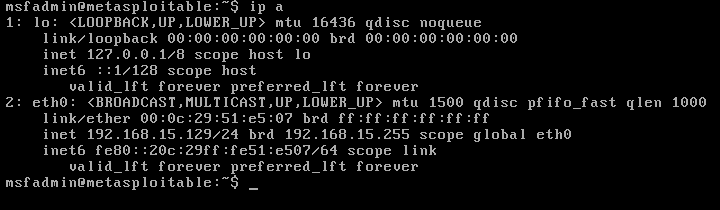
- 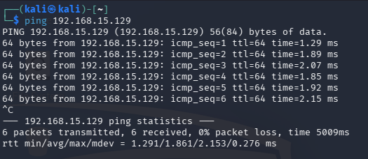
- 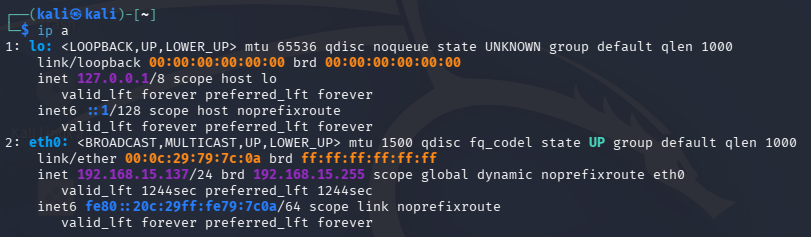
- 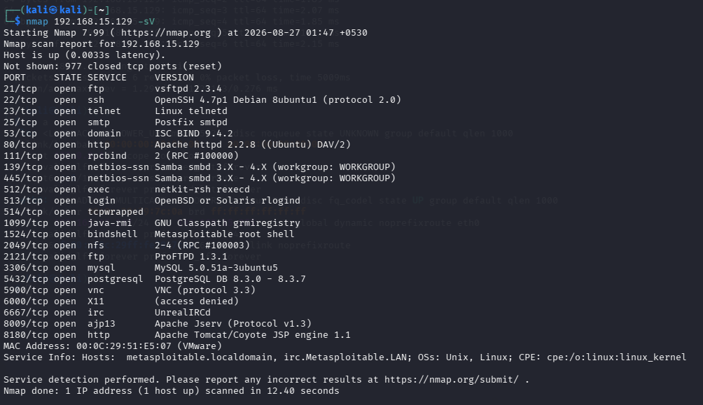
- 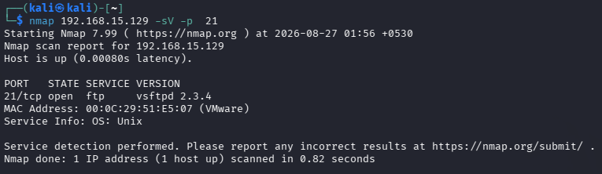

### Figures: Initial Access & Exploitation
- 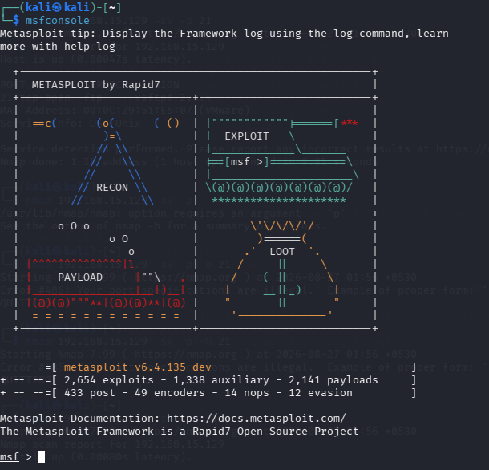
- 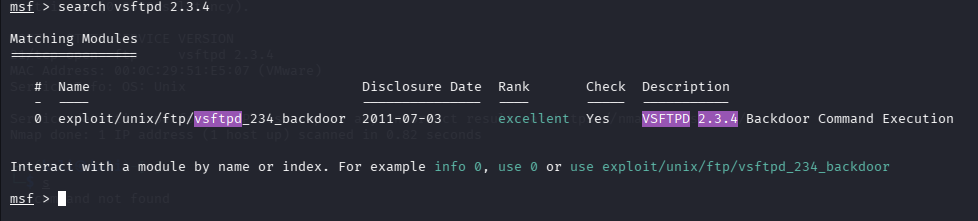
- 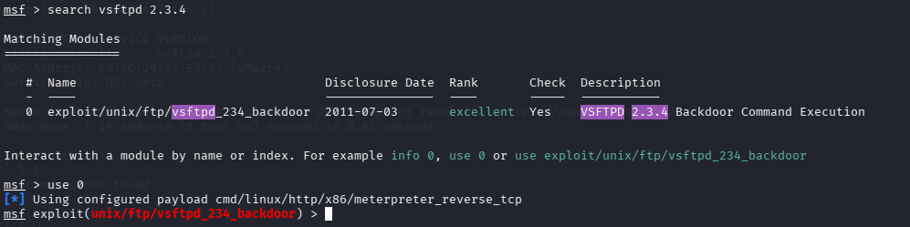
- 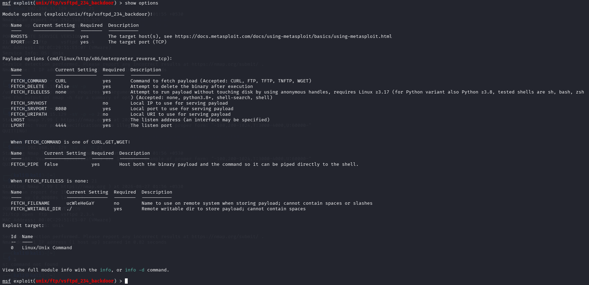
- 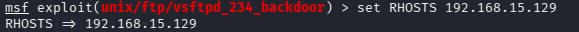
- 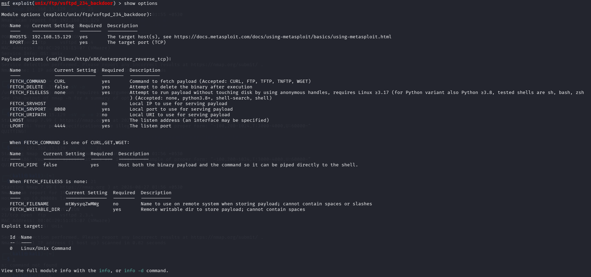
- 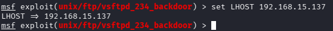
- 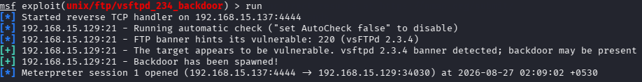

### Figures: Execution & Privilege Verification
- 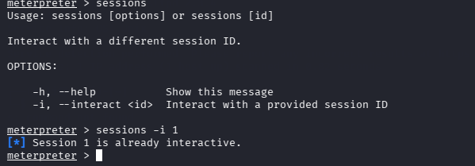
- 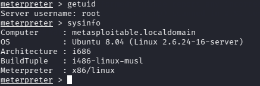
- 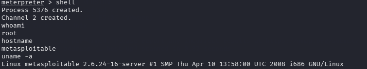
- 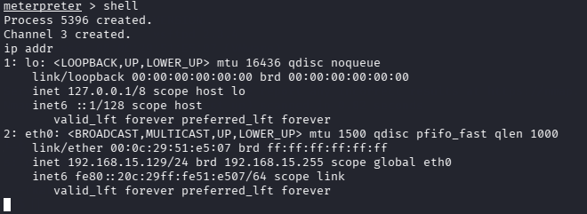
- 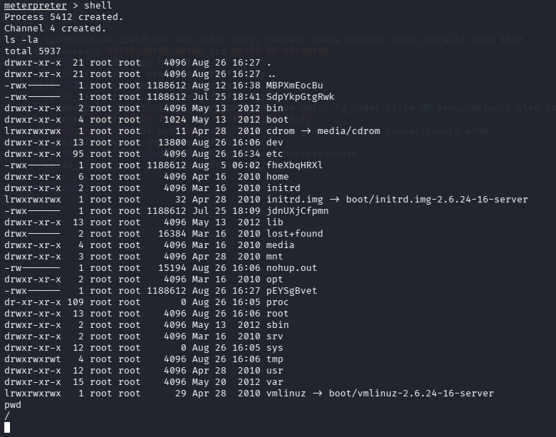
- 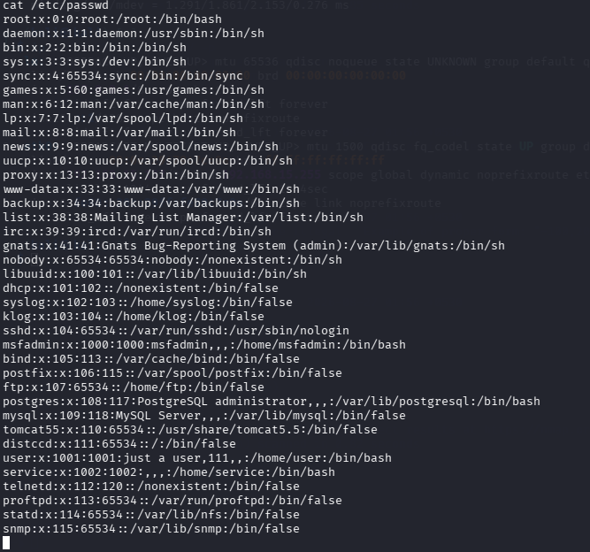

### Figures: Network Detection Evidence
- 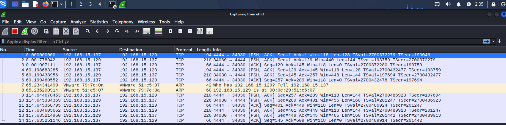

---

*This report documents a simulated attack in an isolated lab environment for training and portfolio purposes.*
